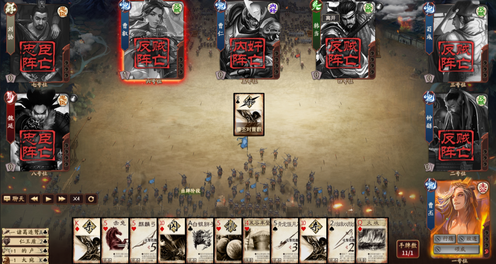
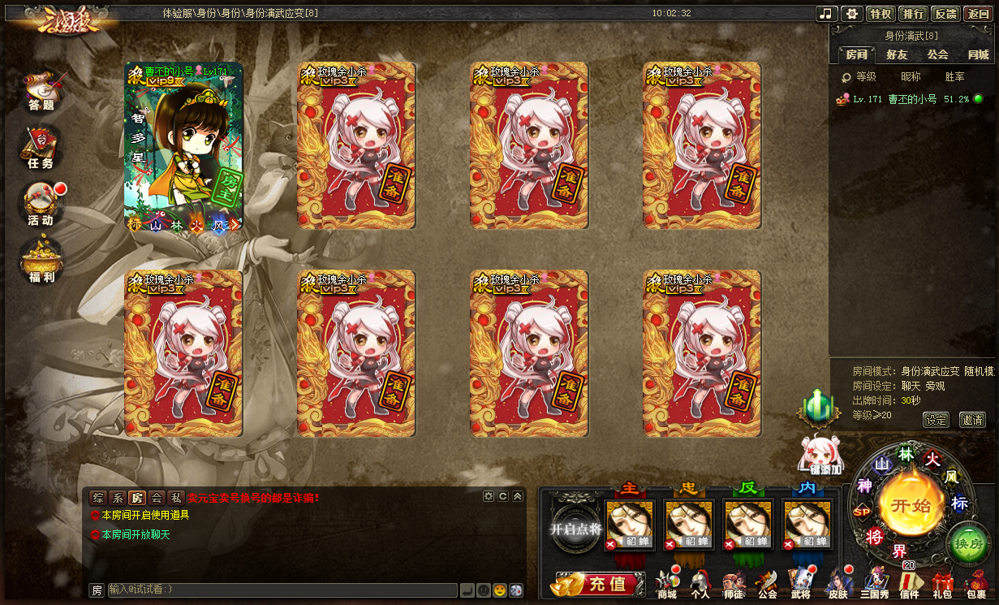
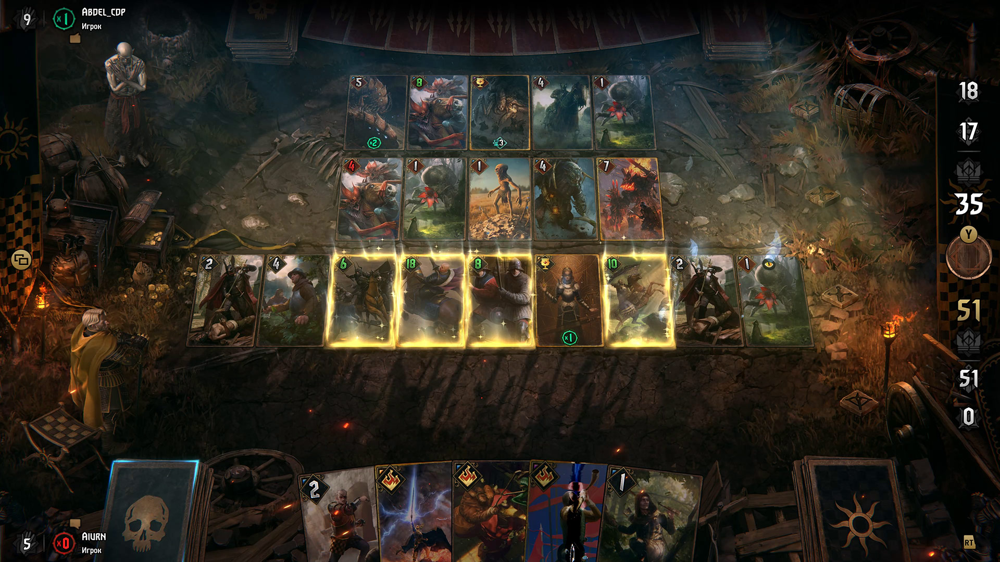

# Tham khảo thiết kế từ internet

Khảo sát ngày 16/09/2026. Chỉ dùng trang của nhà phát hành/đội phát triển làm dẫn chứng. Ba ảnh dưới đã tải và xem trực tiếp; metadata tải và SHA-256 ở [online/manifest.json](online/manifest.json). Đây là ảnh tham khảo thiết kế, không phải asset được duyệt để đưa vào game. Các ảnh cũ được ghi đúng niên đại, không gọi là giao diện mới nhất.

## 1. Tam Quốc Sát: diện mạo trong trận

[Bài sự kiện chính thức ngày 19/12/2019](https://www.sanguosha.com/news/20191219_8089_5016) — [ảnh gốc đã lưu](online/sanguosha-identity-2019.png).

Quan sát: chân dung hình chữ nhật chiếm ưu thế quanh bàn; tên và cờ phe chạy dọc; dấu thân phận tử trận nằm ngay trên chân dung. Ở giữa, nền sáng và ít chi tiết giữ lá đang phân giải dễ nhận ra. Ảnh có nút điều khiển phát lại: đây không phải bằng chứng về tương tác live hay thời lượng animation.

Áp dụng đề xuất: lấy tướng và thẻ làm trọng tâm, tử trận để lại dấu tại ghế. Bỏ ellipse và đại ấn thường trực của mock cũ. Không bê mật độ chữ nhỏ hoặc bố trí tám ghế sang bàn mười người.

## 2. Tam Quốc Sát: phòng chờ

[Thông báo cập nhật chính thức ngày 12/05/2021](https://sanguosha.com/news/20210510_3371_3715) — [ảnh gốc đã lưu](online/sanguosha-room-2021.png).

Quan sát: ghế người chơi là thẻ lớn, dấu chuẩn bị hiện trên thẻ, cấu hình phòng nằm ở cột riêng. Nút bắt đầu nằm trong cụm điều khiển tách biệt. Shop, nhiệm vụ và nhiều biểu tượng phụ cùng hiện trên màn hình.

Áp dụng đề xuất: Room có bảng ghế và tờ luật bên phải; một CTA bắt đầu rõ trạng thái. Avatar tài khoản dùng ở Room, tướng chỉ xuất hiện sau khi được chọn và được phép công khai. Không thêm shop/nhiệm vụ ngoài phạm vi game hiện tại.

## 3. GWENT: khung cảnh và lớp tương tác

[Gallery chính thức CD PROJEKT RED](https://playgwent.com/ru/media) — [ảnh Nilfgaard đã lưu](online/gwent-nilfgaard.jpg). Gallery không ghi ngày chụp; không suy đây là bản hiện hành.

Quan sát: lửa, cờ và đồ vật tập trung bên rìa; lá bài ở cùng mặt phẳng rõ ràng; ánh sáng bám biên lá; các con số vẫn nổi trên nền tối. Đây là ảnh tĩnh, không chứng minh tốc độ hay cơ chế hiệu ứng.

Áp dụng đề xuất: phong cảnh tạo chiều sâu ở rìa; vùng tương tác phẳng và ổn định. Học cách phân lớp môi trường/thông tin. Không dùng hàng quân hai người của GWENT để thay bàn thân phận nhiều người, cũng không thêm mô hình 3D để bắt chước ảnh.

## 4. Hearthstone: hiệu ứng mang thông tin

[Developer Insights: The Art Behind THE SCIENCE — Blizzard, 26/10/2018](https://hearthstone.blizzard.com/en-us/news/22552047).

Đội VFX giải thích vai trò truyền đạt trạng thái, giữ nhận diện qua màu/chất liệu/hình dạng, dành hiệu ứng lớn cho thời điểm đáng chú ý và dùng hiệu ứng bám nhân vật cho trạng thái kéo dài. Ví dụ Magnetic cũng cho thấy hình nối đơn giản, rõ có thể dễ đọc hơn nhiều ký hiệu nhỏ.

Suy luận thiết kế cho project: tách chọn mục tiêu, đợi hồi đáp và gây sát thương; chỉ bùng nổ khi kết quả được xác nhận. Kỹ năng kéo dài dùng badge/viền tại tướng, không phủ vignette cả bàn. Thời lượng trong kế hoạch v3 là ngân sách do chúng ta đề xuất, không phải số đo từ Hearthstone.

## 5. Hearthstone: chữ trên lá bài

[Patch 34.2 — Blizzard, 01/12/2025](https://hearthstone.blizzard.com/en-gb/news/24244424).

Bản cập nhật đưa chữ Signature Card lên lá thay vì chỉ ở tooltip; có lựa chọn ưu tiên hình hoặc chữ, và đặt chữ nhất quán với các lá khác để dễ quét mắt.

Suy luận thiết kế: tay bài của chúng ta phải có tên/chất/số đọc được trực tiếp. Inspector dành cho luật dài; không dùng ảnh chữ Trung thu nhỏ rồi trông chờ tooltip giải quyết mọi việc. Giữ cùng vị trí tên/chất/số ở mọi loại lá.

## Quyết định rút ra

Hướng thống nhất là **tranh chiến trận ở rìa, chân dung tướng trên thẻ sơn then viền đồng, giấy bài sáng và chữ Việt rõ**. Đây là đề xuất riêng sau đối chiếu, không phải kết luận nhà phát hành đưa ra. Dấu ấn chỉ xuất hiện ngắn ở khai chiến/kết thúc/tử trận. Không cần một đại ấn nằm thường trực giữa bàn.

Đối chiếu local cùng các ảnh trên ở [kế hoạch v3](../2026-09-16-ui-upgrade-plan-v3.md). Không suy quyền sử dụng art từ việc một ảnh có thể tải trên internet.

---

> **Trạng thái lịch sử:** đây là nguồn tham khảo hình ảnh đã khảo sát ngày 16/09/2026, không phải asset được duyệt để ship. Đọc cùng [UI upgrade v4 Gemini handoff](../2026-09-20-gitnexus-plan-ui-upgrade-handoff.md), tài liệu quyết định triển khai hiện hành.
